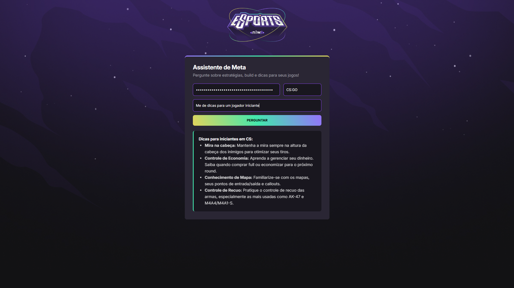

# 🤖 NLW Agents - Assistente de Jogos com IA

<p align="center">
  Projeto desenvolvido durante a 20ª edição do Next Level Week (NLW) da Rocketseat.
</p>

<p align="center">
  
</p

## 🎯 Sobre o Projeto

O **NLW Agents** é um assistente virtual inteligente, especializado em fornecer dicas, estratégias e as melhores _builds_ para diversos jogos online. Utilizando o poder da **API do Google Gemini**, a aplicação oferece respostas atualizadas e precisas para ajudar jogadores a melhorarem sua performance.

A interface é simples e intuitiva: basta selecionar o jogo, inserir sua pergunta e obter uma resposta gerada por IA em segundos!

---

## ✨ Tecnologias Utilizadas

Este projeto foi construído com as seguintes tecnologias e ferramentas:

- **Frontend:**
  - 
  - 
  - 
- **API:**
  - 
- **Bibliotecas:**
  - **Showdown.js:** Para converter as respostas em Markdown para HTML de forma elegante.

---

## 🚀 Como Executar o Projeto

Para rodar este projeto na sua máquina, siga os passos abaixo.

### Pré-requisitos

- Um navegador web moderno (Chrome, Firefox, Edge, etc.).
- Uma chave de API do Google Gemini.

### Passo a Passo

1.  **Clone o repositório:**

    ```bash
    git clone https://github.com/seu-usuario/seu-repositorio.git
    cd seu-repositorio
    ```

    _(Lembre-se de substituir `seu-usuario/seu-repositorio` pelo link do seu repositório real no GitHub)_

2.  **Obtenha sua Chave de API (API Key):**

    - Acesse o **Google AI Studio**.
    - Faça login com sua conta Google.
    - Clique em "**Get API key**" e crie uma nova chave em um projeto.
    - Copie a chave gerada. Ela será necessária para usar a aplicação.

    > ⚠️ **Importante:** Sua chave de API é secreta! Não a compartilhe publicamente nem a envie para repositórios no GitHub. O ideal é usar variáveis de ambiente em projetos mais complexos.

3.  **Abra o projeto no navegador:**

    - A forma mais simples é abrir o arquivo `index.html` diretamente no seu navegador.
    - **(Recomendado)** Para uma melhor experiência e para evitar possíveis problemas de CORS, utilize um servidor local. Se você usa o Visual Studio Code, pode instalar a extensão **Live Server** e clicar em "Go Live" no canto inferior direito do editor.

4.  **Utilize a Aplicação:**
    - Com a página aberta, cole sua **API Key** no campo indicado.
    - Selecione o jogo desejado.
    - Digite sua pergunta.
    - Clique em "Perguntar" e aguarde a magia acontecer! ✨

---

## 🤝 Como Contribuir

Contribuições são o que tornam a comunidade de código aberto um lugar incrível para aprender, inspirar e criar. Qualquer contribuição que você fizer será **muito apreciada**.

1.  Faça um **Fork** do projeto.
2.  Crie uma nova Branch (`git checkout -b feature/sua-feature`).
3.  Faça o **Commit** das suas alterações (`git commit -m 'Adiciona nova feature'`).
4.  Faça o **Push** para a Branch (`git push origin feature/sua-feature`).
5.  Abra um **Pull Request**.

---

## 📄 Licença

Este projeto está sob a licença MIT.

---

<p align="center">
  Feito com ❤️ por <strong>Kaue Guimarães</strong>, com a ajuda da <strong>Rocketseat</strong> 🚀
</p>
